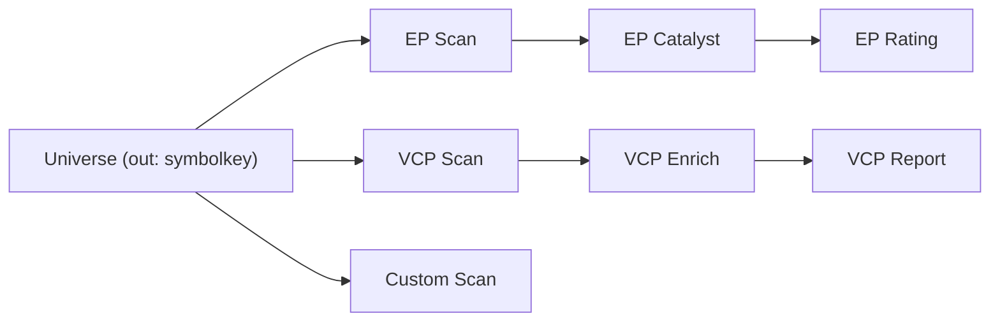

# Pipeline Graph Editor — Spec + UX Contract

> **SUPERSEDED — re-scoped.** This spec describes the family-specific node model (EP Scan / VCP Enrich as distinct node types, enforced Roles 1→3). The effort has been re-scoped to a **component-based model** (Scanner / Quant Filter / AI Search / Report added via a + button, relaxed wiring, component + graph templates). See [map.md](map.md) and the open tickets under `issues/`. Facts here remain useful as research inputs (ticket 02 → tickets 12/14–17; ticket 07 → ticket 18).

Handoff artifact for the destination: a typed, n8n/Railway-style Pipeline Graph Editor on the dashboard. Everything below is a locked decision; the implementer should not need to reopen product questions. Detail lives in the child tickets under `issues/`.

## 1. Shape of the graph

- A Pipeline Definition is a **typed DAG** of Phases. Fan-out copies the stock set; merge unions by `SymbolKey`; cycles forbidden.
- Phases occupy **Roles** on a path: Role 1 (Scan) → Role 2 (Enrich) → Role 3 (Rate/Report). A family must match along one path; families are mixed by fanning Universe out to multiple Role 1 nodes.
- **Universe Node** is the start: one `out` Port (`symbolkey`), runtime-bound (the Run supplies paste / sweep / Force Include).



## 2. Ports

Port types (from ticket 02): `symbolkey`, `ep_scan`, `catalyst`, `ep_rated`, `vcp_scan`, `bo_scan`, `context`, `vcp_rated`, `bo_rated`, `custom_scan`.

- Each Port is `required` or `optional`; optional may be left unconnected.
- Assignability: `catalyst` is assignable to `ep_scan` (EP Rating reads structural fields carried through Catalyst). All other types match exactly.
- Skip Enrich: Scan → Rate/Report is legal in all families. VCP/BO Report has a required `structural` Port + optional `context` Port; with context unconnected, `final_rating = structural/funnel`, `cap_applied=false`, `cap_reason="no_enrichment"`, context fields null.

| Node type | Role | Input Port(s) | Output Port |
|---|---|---|---|
| `universe` | start | — | `out` (`symbolkey`) |
| `ep_scan` | 1 | `universe` (`symbolkey`) | `bucket` (`ep_scan`) |
| `ep_catalyst` | 2 | `scan` (`ep_scan`) | `enriched` (`catalyst`) |
| `ep_rating` | 3 | `structural` (`ep_scan`, accepts `catalyst`) | `rated` (`ep_rated`) |
| `vcp_scan` | 1 | `universe` (`symbolkey`) | `bucket` (`vcp_scan`) |
| `vcp_enrich` | 2 | `scan` (`vcp_scan`) | `enriched` (`context`) |
| `vcp_report` | 3 | `structural` (`vcp_scan`) + `context` (`context`, optional) | `rated` (`vcp_rated`) |
| `bo_scan` | 1 | `universe` (`symbolkey`) | `bucket` (`bo_scan`) |
| `bo_enrich` | 2 | `scan` (`bo_scan`) | `enriched` (`context`) |
| `bo_report` | 3 | `structural` (`bo_scan`) + `context` (`context`, optional) | `rated` (`bo_rated`) |
| `custom_scan` | 1 | `universe` (`symbolkey`) | `bucket` (`custom_scan`) |

## 3. Variables (inspector)

Every gate/threshold/cap/profile is an editable inspector variable on its owning Phase. The full inventory with `file:line` is ticket 01; highlights:

- **EP Scan**: `select` (`baseline|strict|both`), `limit`, `apply_gates`, plus Baseline/Strict `GateThresholds` (price, gap, rvol10, mcap range, ADV$, event$).
- **EP Catalyst**: `max_results` (3). **EP Rating**: `max_results` (5), `min_rating` (4), hard-cap ceilings.
- **VCP Scan**: `MIN_ADV_DOLLAR`, `MIN_MARKET_CAP`, Stage-2 RS floor, structural gate floor, 9-param rubric thresholds.
- **VCP/BO Enrich**: dual-query `max_results` (5/5).
- **BO Scan**: impulse, ADR, base days, VCI, surfing, surge, dry-up constants; `bo_profile` (`best|moderate-lose|widen`); funnel Q_base floors.
- **VCP/BO Report**: down-only caps + `min_rating`.

## 4. Custom Scan protocol

In-repo registry in `stock_analyze/custom_scans/`: a `@register("id")` decorator fills `REGISTRY: dict[str, CustomScanSpec]`. Protocol:

```python
Callable[[list[SymbolKey], dict[str, Any]], list[dict]]
# returns rows like {"symbol": "AAPL", "exchange": "NASDAQ", ...opaque}
```

Custom Scan is scan-only; merges by lane keyed on `SymbolKey`. The server imports and validates callables at startup; the canvas Custom Scan node carries a `scan_id` variable listing `get_registered_scans()`.

## 5. Storage + API

- `pipeline_definitions(id uuid pk, name text, graph jsonb, created_at, updated_at)`.
- `runs` gains `definition_id uuid null` + `graph_snapshot jsonb null`. On `POST /api/runs` with a `definition_id`, freeze `graph` into `graph_snapshot`. Universe is per-Run.
- `GET/POST /api/definitions`, `GET/PUT/DELETE /api/definitions/{id}`.

Definition `graph` JSON: `{ nodes: [{id, type, position, variables}], edges: [{id, source, sourceHandle, target, targetHandle}] }`.

## 6. Canvas UX contract

- Phases = React Flow nodes; Ports = typed handles (`id` = Port name). Wire by dragging source → target handle.
- One root `isValidConnection` enforces the port-type matrix and Role/family ordering; incompatible wires are rejected (snap-back, `connecting`/`valid` handle classes). No cycles.
- Inspector = selection-driven side `Panel`; edits write to `node.data.variables`.
- Results = tabbed Table / JSON / Schema; final view is a SymbolKey lane-merge table (one row per symbol, family/source tag + generic rating, duplicates collapsed).

## 7. Still open (handed to build as fog)

- **DAG walker**: server-side execution of a snapshot against today's `run_daily`. Requires factoring VCP/BO Report out of `execute_vcp_enrichment`/`execute_bo_enrichment` into a standalone Phase.
- Per-Phase inspector layout details.
- Whether the CLI/wizard loads Pipeline Definitions.

## Out of scope

Production editor build; mixing families on one path; gate-as-nodes; cycles; in-browser code nodes; Custom Phase 2/3; multi-user auth; Adapter phases.
