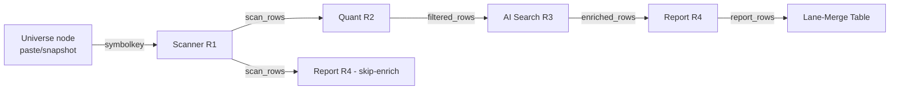

# Component Graph Editor

- **Purpose**: replace the family-specific (EP/VCP/BO) pipeline model with a component graph: Scanner/Quant/AI Search/Report tools wired on a React Flow canvas, executed by a pure-Python walker, results in a SymbolKey lane-merge table.
- **Key entry points**: `GET /api/tools` → palette (`server/app/routes/tools.py`); `POST /api/definitions` / `POST /api/component-templates` (`server/app/routes/definitions.py`); `POST /api/runs` with inline `graph` or `definition_id` (`server/app/routes/runs.py:101`); `POST /api/runs/preview` (`server/app/routes/runs.py:125`); editor page `web/app/editor/page.tsx` → `web/components/GraphEditor.tsx`.
- **Depends on**: `stock_analyze/tools/` package (protocol → registry → builtins → walker), existing pipeline runners (`stock_analyze/pipeline.py`), `server/app/db.py` Repo, `server/app/jobs.py`.
- **Depended by**: server app factory (`server/app/main.py`), web API client (`web/lib/api.ts`), run detail page (`web/app/runs/[id]/page.tsx`).

## Architecture

Data flow: canvas JSON (ReactFlow shape) → `to_walker_definition` → flattened definition JSON → `run_graph` (topo order) → rows keyed by `(symbol, exchange)` flow port-to-port with auto-merge at junctions → terminal `report_rows` normalized into the lane-merge table.



- Built-ins registered at import in `stock_analyze/tools/__init__.py`; server re-validates the whole registry in `_lifespan` (`server/app/main.py:22-25`).
- Daily presets (`Daily VCP Scan` / `Daily BO Scan` / `Daily EP Scan`) are seeded in `_lifespan` via `seed_default_definitions` (`server/app/seed.py:56`) — idempotent by name, guarded by try/except so a seed failure never takes the server down.
- Graph runs dispatch to `run_graph_job` (`server/app/jobs.py:86`); legacy runs keep the `run_daily` path. Per-node outputs persist as artifact stage `node:<node_id>`.
- Preview estimates are advisory (`stock_analyze/tools/preview.py`) — the walker never consults them.

## Key Symbols

| Symbol | File:Line | Role |
|--------|-----------|------|
| `PortStage` / `PORT_STAGES` | `stock_analyze/tools/protocol.py:18/26` | 5 canonical row stages |
| `INPUT_ACCEPTS` / `stage_accepts` | `stock_analyze/tools/protocol.py:37/46` | port-stage assignability matrix (canonical) |
| `ERROR_KEY` (`_error`) | `stock_analyze/tools/protocol.py:53` | soft-fail marker on a degraded row |
| `PortDef` / `VariableDef` / `ToolSpec` | `stock_analyze/tools/protocol.py:60/74/90` | port, inspector var, and tool contracts |
| `ToolSpec.callable` | `stock_analyze/tools/protocol.py:106` | `(inputs: dict[port_id, list[row]], params) -> list[row]` |
| `REGISTRY` / `register` / `get_tools` | `stock_analyze/tools/registry.py:15/30/44` | tool registry |
| `validate_registry` / `registry_payload` | `stock_analyze/tools/registry.py:53/99` | startup validation; `GET /api/tools` payload |
| `SCANNER_VARS`/`QUANT_VARS`/`SEARCH_VARS`/`REPORT_VARS` | `stock_analyze/tools/variables.py:17/71/112/124` | finalized inspector surfaces (T14-17) |
| `_scanner_callable` / `_quant_callable` / `_is_structural` / `_search_callable` / `_report_callable` | `stock_analyze/tools/builtins.py:55/109/180/187/252` | built-in tool callables wrapping pipeline runners; `_is_structural` splits VCP/BO (structural/funnel) rows from EP rows in AI Search |
| `PRESET_DEFINITIONS` / `seed_default_definitions` | `server/app/seed.py:49/56` | three daily preset canvas graphs + idempotent seed-if-absent-by-name |
| `symbol_key` / `merge_rows` / `to_merge_table` | `stock_analyze/tools/merge.py:16/23/44` | SymbolKey identity, junction merge, lane-merge table |
| `validate_graph` / `find_cycle` / `topological_order` | `stock_analyze/tools/walker.py:68/159/196` | graph validation (cycles, unknown tools, unfed ports, stage mismatch) |
| `run_graph` | `stock_analyze/tools/walker.py:226` | walker executor; `on_node` callback feeds SSE |
| `to_walker_definition` / `to_canvas_graph` / `validate_canvas_graph` | `stock_analyze/tools/canvas.py:26/70/106` | canvas JSON ↔ definition JSON bridge |
| `estimate_graph_run` / `estimate_symbol_count` | `stock_analyze/tools/preview.py:29/74` | cost/duration preview |
| `RunCreate` | `server/app/schemas.py:13` | accepts `definition_id`/`graph`/`universe_source`/`node_overrides` |
| `_resolve_run_graph` | `server/app/routes/runs.py:34` | fetch + validate graph on `POST /api/runs` / preview |
| `preview_run` | `server/app/routes/runs.py:125` | `POST /api/runs/preview` |
| `resolve_universe` | `server/app/jobs.py:24` | paste parse or snapshot sweep → symbolkey rows |
| `run_graph_job` | `server/app/jobs.py:86` | execute + persist `node:<id>` artifacts + `merge_table` |
| `report_vcp` / `report_bo` | `stock_analyze/pipeline.py:623/663` | factored Agent-3 loops; no context → `cap_applied=false, cap_reason="no_enrichment"` |
| `isWireValid` / `INPUT_ACCEPTS` mirror / `visibleVars` | `web/lib/graph.ts:47/4/38` | canvas wiring legality + family-filtered inspector vars |
| `GraphEditor` | `web/components/GraphEditor.tsx` | palette, canvas, inspector, templates UI, run/preview modal, progress |
| `MergeTable` | `web/components/MergeTable.tsx` | lane-merge results view |
| `listTools`/`saveDefinition`/`saveComponentTemplate`/`previewRun` | `web/lib/api.ts` | frontend API client for T20/T22 endpoints |

## Canonical JSON shapes

Canvas graph (stored in `pipeline_definitions.graph`):

```json
{"name": "...", "nodes": [{"id": "sc_1", "type": "scanner", "position": {"x":0,"y":0}, "variables": {"family":"vcp"}}],
 "edges": [{"id": "e1", "source": "universe", "sourceHandle": "out", "target": "sc_1", "targetHandle": "universe"}]}
```

Walker definition (produced by `to_walker_definition`):

```json
{"version": 1, "name": "...", "universe": {"source": "paste", "force_keys": [["AAPL","NASDAQ"]], "scan_id": null},
 "nodes": [{"id": "sc_1", "tool_id": "scanner", "params": {"family":"vcp"}}],
 "edges": [{"id": "e1", "source": "universe", "source_port": "out", "target": "sc_1", "target_port": "universe"}]}
```

## Edge Cases / Gotchas

- `_quant_callable` is a pure row-filter: a row missing a required filter field (e.g. `adv_20d` when `q_min_adv_dollar > 0`) is soft-failed with an `ERROR_KEY` marker, dropped from the forward stream, and recorded on the node result.
- Quant `QUANT_VARS` defaults are all non-zero thresholds — a graph run that leaves them at defaults soft-fails rows that lack the fields. E2E tests zero them explicitly.
- `_apply_caps` (EP caps) only applies to rows carrying `catalyst_type`; VCP/BO lanes are never clamped.
- `_search_callable` routes rows by `_is_structural` (`builtins.py:180`): a row with `structural_rating` **or** `funnel_stars` goes to VCP/BO enrichment; only rows with neither hit the EP catalyst + rating chain. BO rows carry `funnel_stars` (no `structural_rating`, no `catalyst_type`), so they are never clamped by EP caps.
- Snapshot universes no longer require `universe_scan_id` — the field is kept as an optional label, and neither the `RunCreate` schema nor `validate_graph` enforces it (`server/app/schemas.py`, `stock_analyze/tools/walker.py`).
- The universe-source default is stored as `graph.defaults.universe_source` (BO `"snapshot"`, VCP/EP `"paste"`). The walker ignores this extra top-level key; the editor reads it to pre-select the Universe binding on load and re-emits it on save.
- The merge table's `rating` is read from the `rating` column set by the Report callable — never from `structural_rating` directly.
- Node-level exceptions degrade the run (`degraded=true`) and downstream nodes receive empty input; they do not abort the batch. Hard failures (validation) raise `GraphValidationError`.
- `validate_graph` skips the implicit-universe required-input check for `symbolkey` ports; source ports of universe edges aren't validated.
- An edge referencing an unknown source node is collected as an error, not a crash (fixed: source lookup guarded).
- `RunCreate` schema still requires `pipeline_type` for legacy compatibility; the graph path ignores it.
- SSE terminal replay (`server/app/routes/runs.py:61`) includes `merge_table` for succeeded graph runs.

## Tests

- `server/tests/core/test_tools_registry.py` — registry, stage matrix, merge, lane-merge table, preview.
- `server/tests/core/test_builtin_search.py` — AI Search BO/EP routing (`_is_structural` split).
- `server/tests/core/test_walker.py` — validation, cycles, topo order, fan-out copy, junction merge, soft-fail, degraded node, `on_node`.
- `server/tests/test_seed.py` — preset seeding (3-created, idempotent, edit-preserving, delete-resurrect, universe hints, valid graphs).
- `server/tests/core/test_report_factoring.py` — `report_vcp`/`report_bo` no-context + cap behavior.
- `server/tests/test_definitions_api.py` — tools/definitions/templates CRUD, preview, graph-run via `/api/runs` (artifacts + merge table + SSE replay), snapshot-without-scan_id validation.
- `web/__tests__/graph.test.ts` — `isWireValid`, `defaultsFor`, `scannerGroups`, `visibleVars`, universe/component node split.
