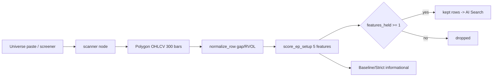

# EP Pipeline — Stock Analyze Project

- **Purpose**: Multi-agent stock scanner that discovers US equities with Episodic Pivot (EP) characteristics via TradingView screener, enriches with news catalysts (Tavily + OpenRouter LLM), and rates EP catalyst fit on a 1–5 scale. A pure-math **EP Technical Setup Test** (`scanners/ep/setup.py`) computes 5 boolean OHLCV features; with the feature toggle active, survivors = stocks where ≥1 enabled feature holds (gates become informational-only).
- **Key entry points**: `stock_analyze/cli.py:132` → `main()` (argparse: `ep|catalyst|rate`), `stock_analyze/interactive.py:316` → `run_interactive()` (questionary wizard), `stock_analyze/pipeline.py:1129` → `run_daily()` (full pipeline), `stock_analyze/scanners/ep/setup.py:236` → `score_ep_setup()`
- **Depends on**: `tradingview_screener`, `tvDatafeed`, `tavily`, `openai` (OpenRouter), `pydantic`, `pandas`, `rich`, `questionary`
- **Version**: 0.1.0

---

## Project Structure

```
mcp_stock_analyze/
├── stock_analyze/           # Main package
│   ├── __init__.py          # __version__ = "0.1.0"
│   ├── __main__.py          # python -m entry: calls cli.main()
│   ├── cli.py               # Argparse CLI (ep|catalyst|rate subcommands)
│   ├── pipeline.py          # Daily Run orchestrator (Agent 1→2→3 chain)
│   ├── interactive.py       # questionary interactive wizard (Auto/Manual)
│   ├── force_include.py     # LLM-based parser for pasted ticker lists
│   ├── progress.py          # Rich live progress (RunProgress + rating table)
│   ├── models/              # Pydantic schemas (EP pipeline only)
│   │   ├── __init__.py      # Re-exports all public models
│   │   ├── common.py        # AsOf = Union[date, datetime]
│   │   ├── ep.py            # EpStock, GateThresholds, StockBucket, EpScanResult
│   │   ├── catalyst.py      # CatalystSummary, CatalystEnrichedStock, CatalystBucket
│   │   └── rating.py        # EpRatedStock, EpRating, RatedBucket
│   ├── agents/              # Agent 2 (Catalyst) + Agent 3 (Rating)
│   │   ├── __init__.py      # Public API: enrich_with_catalysts, rate_ep_catalysts
│   │   ├── catalyst.py      # Tavily news search + OpenRouter compression
│   │   └── rating.py        # Re-fetch news + LLM rates 1–5 + hard caps
│   ├── scanners/ep/         # Agent 1 (technical filter)
│   │   ├── __init__.py      # Lazy-imports run_ep_scan
│   │   ├── gates.py         # BASELINE/STRICT thresholds, passes_baseline(), passes_strict()
│   │   ├── metrics.py       # normalize_row() — screener row → EpStock
│   │   └── runner.py        # run_ep_scan(), merge_force_rows()
│   └── data/                # Market-data adapters
│       ├── __init__.py
│       ├── screener.py      # fetch_us_ep_universe(), fetch_symbols()
│       ├── symbols.py       # SymbolKey, parse_symbol_exchange(), row_symbol_key()
│       └── tradingview.py   # enrich_from_ohlcv() fallback + tvDatafeed wrappers
├── models.py                # Legacy root-level VCP Pydantic models (NOT EP)
├── vcp_scan.py              # Legacy VCP pattern scanner (~500 lines)
├── vcp_analyzer.py          # Legacy VCP multi-agent analysis (~660 lines)
├── tradingview_data.py      # Legacy tvDatafeed wrapper (~420 lines)
├── run.ps1 / run.sh         # Launch scripts: pytest preflight → interactive wizard
├── requirements.txt         # pip dependencies
├── .env                     # API keys (TAVILY_API_KEY, OPENROUTER_API_KEY)
└── output/                  # Run artifacts (YYYY-MM-DD/HHMMSS_name/)
```

**Legacy files** (`models.py`, `vcp_scan.py`, `vcp_analyzer.py`, `tradingview_data.py`) live at root level and are **not part of the EP pipeline**. They provide VCP (Volatility Contraction Pattern) scanning via an older multi-agent design. The EP pipeline's `stock_analyze/data/tradingview.py` lazy-loads `tradingview_data.py` as an OHLCV fallback.

---

## Architecture: 3-Agent EP Pipeline

```
[TradingView Screener]          [Force Include (user paste)]
        |                              |
        v                              v
   fetch_us_ep_universe()        parse_force_include_text()
        |                              |
        +--- merge_force_rows() -------+
                    |
                    v
          run_ep_scan() → normalize_row() [each row → EpStock]
                    |
          ┌---------+---------┐
          v                   v
    BASELINE bucket       STRICT bucket
    (loose)               (tight gates)
          |                   |
          +--- select: ------+
                    |
                    v
          load_stocks_from_input()
                    |
                    v
          enrich_with_catalysts()  [Agent 2: Tavily search → LLM compress per symbol]
                    |
                    v
          rate_ep_catalysts()      [Agent 3: re-fetch news → LLM rate 1–5 → hard caps]
                    |
                    v
          build_rating_table()     [Rich table of ★4–5 stocks]
```

### Agent 1 — Technical Filter (`scanners/ep/`)

1. `fetch_us_ep_universe()` (`data/screener.py:42`) queries TradingView screener with Baseline pre-filters (price≥1, gap≥4%, rvol10≥1.5), limit=300, US listed exchanges only.
2. `parse_force_include_text()` (`force_include.py:39`) uses OpenRouter LLM to extract SymbolKeys from messy paste text.
3. `merge_force_rows()` (`scanners/ep/runner.py:118`) merges screener + force rows; screener row wins on duplicate.
4. `run_ep_scan()` (`scanners/ep/runner.py:24`) normalizes each row via `normalize_row()` (`scanners/ep/metrics.py:27`), applies `passes_baseline()` / `passes_strict()` (`scanners/ep/gates.py:22,30`), returns `EpScanResult` with both buckets. When `ep_features=True`, per-symbol OHLCV is fed to `score_ep_setup()` and the keep rule switches to **features_held ≥ 1** (gates stay computed but never filter).
5. `_build_ep_rows()` (`pipeline.py:271`) optionally fetches each symbol's OHLCV once (`collect_ohlcv=feature_mode`), passes the DataFrame straight into `to_ep_row()` (`data/polygon.py`, `df=` arg avoids a redundant refetch) and returns `df_by_symbol` for feature scoring.

### Agent 2 — Catalyst Intelligence (`agents/catalyst.py`)

1. `load_stocks_from_input()` (`agents/catalyst.py:38`) extracts stock dicts from Agent 1 JSON buckets (handles baseline/strict/both).
2. `enrich_with_catalysts()` (`agents/catalyst.py:78`) per symbol: Tavily search (3 results, `max_results=3`) → OpenRouter LLM compress to `CatalystSummary` (JSON schema). Soft-fails per symbol.
3. Uses model `deepseek/deepseek-v4-flash-0731` (configurable via `CATALYST_LLM_MODEL` env).

### Agent 3 — EP Rating (`agents/rating.py`)

1. `rate_ep_catalysts()` (`agents/rating.py:72`) per symbol: re-fetches Tavily news (5 results, independent of Agent 2) → OpenRouter LLM rates 1–5 → `apply_rating_caps()` hard clamps.
2. `apply_rating_caps()` (`agents/rating.py:49`) — down-only caps by catalyst_type:
   - UNKNOWN / no catalyst_found → max 2
   - PR → max 3
   - CONTRACT / FDA → max 4
   - rvol10 < 3.0 → max 4
   - Only EARNINGS / GUIDANCE can reach 5
3. Uses model `deepseek/deepseek-v4-pro` (configurable via `EP_RATING_LLM_MODEL` env).
4. Results sorted best→worst by `(-ep_rating, -rvol10, symbol)`.

---

## Gate Thresholds

| Gate | `gates.py` | min_price | min_gap_pct | min_rvol10 | min_market_cap | max_market_cap | min_avg_dollar_volume_50d | min_event_dollar_volume |
|------|-----------|-----------|-------------|------------|---------------|---------------|--------------------------|------------------------|
| BASELINE | `:5` | 1.0 | 4.0% | 1.5 | — | — | — | — |
| STRICT | `:11` | 10.0 | 8.0% | 3.0 | $300M | $10B | $5M | $20M |

These are serialized into every `EpScanResult.gates` dict for downstream traceability.

---

## EP Technical Setup Test (`scanners/ep/setup.py`)

- **Purpose**: Pure-math (no LLM) OHLCV layer computing 5 boolean setup features for each EP candidate. With the section active, a stock survives when `features_held ≥ 1` over the **enabled** features; the Baseline/Strict gates are computed and displayed but never filter. All-features-off falls back to gate semantics.
- **Key entry point**: `score_ep_setup(df, *, enabled=None, thresholds=None, symbol="", exchange="", as_of=None) -> EpSetupFeatures` (`setup.py:236`)
- **Depends on**: `pandas` + `stock_analyze/scanners/bo/metrics.py` helpers (`find_local_peaks`, EMA, dry-up ratio patterns)
- **Depended by**: `run_ep_scan()` (`scanners/ep/runner.py:24`)

### Event window

- `EVENT_LOOKBACK_BARS = 63` (`setup.py:32`) — scan backward over the last 63 bars.
- **event day** = the highest-RVOL10 bar in that window (the gap/earnings shock). `_event_idx()` (`setup.py:62`) returns its positional index, or `None` for short/empty frames.
- Features score the **post-event setup**: pullback + EMA/VWAP support.

### The 5 features

| Feature | Detection (`setup.py`) | Default threshold |
|---|---|---|
| `base_detected` | `_detect_base()` `:116` — pivot (reused `find_local_peaks`) + ascending swing highs with higher low + volume contrast (pullback bars ≤ `ep_pullback_vol_ratio`× event vol, up-leg ≥ 1.5× pullback avg); base 5–40d after event | min/max days 5/40 |
| `volume_spike` | `_detect_volume_spike()` `:74` — event-day volume ≥ `ep_spike_min`× the 50-day average volume | 3.0× |
| `pullback_contrast` | `_detect_pullback()` `:89` — post-event pullback (low ≥ `ep_pullback_depth_pct`% below post-event high) on contrasting volume (pullback avg ≤ `ep_pullback_vol_ratio`× event vol), last close above pullback low | depth 10%, vol ratio 0.5× |
| `ema_support` | `_detect_ema_support()` `:159` — close above EMA9/20/50 with stack ordered EMA9>EMA20>EMA50; ≥2 of 3 EMAs touched-and-held since event (bar low within `ep_ema_touch_pct`% of EMA, close back above) | touch 2% |
| `vwap_support` | `_detect_vwap()` `:220` + `_anchored_vwap()` `:189` + `_vwap_support_at()` `:201` — anchored cumulative VWAP from the event bar forward; if no support there, fall back to a higher-low/higher-high **pivot** anchor; feature holds when a post-event bar low dipped within `ep_vwap_touch_pct`% of VWAP, close recovered, current close > VWAP | touch 1.5% |

### Semantics

- `enabled` dict (`_EP_FEATURE_KEYS` order) controls which features count toward `features_held`; **unspecified keys default to enabled**.
- `features_held = count of enabled held features`; survive iff `features_held ≥ 1` (when section active).
- Missing/short OHLCV (`df` is `None` or `< EVENT_LOOKBACK_BARS` rows) → all features `False`, `features_held = 0`, so the stock is dropped in feature mode.
- Threshold model: `EpSetupThresholds` (`setup.py:44`) — pydantic, defaults mirror `SCANNER_VARS`.

### Data flow (toggle ON)



### Dedup note

In feature mode a stock can pass **both** buckets → `_rows_from_payload` (`tools/builtins.py:24`) dedupes EP-family rows by uppercase symbol key.

---

## Key Symbols

### `stock_analyze/pipeline.py`

| Symbol | Line | Role |
|--------|------|------|
| `RunConfig` | `:92` | dataclass — all pipeline parameters (name, select, limit, force_keys, use_screener, apply_gates, etc.) |
| `RunResult` | `:108` | dataclass — exit_code, run_dir, steps_completed, error |
| `create_run_dir()` | `:115` | Creates `output/YYYY-MM-DD/HHMMSS_name/` |
| `execute_ep_scan()` | `:165` | Agent 1: screener → force merge → scan → JSON payload with `_counts`; accepts `ep_features`, `ep_feature_keys`, `ep_keep_if_any`, `ep_thresholds` |
| `_build_ep_rows()` | `:271` | Resolve symbols → rows; `collect_ohlcv=True` fetches per-symbol DataFrame once and passes it to `to_ep_row(df=...)`; returns `(ep_rows, failed_force, df_by_symbol)` |
| `_execute_ep_sweep()` | `:334` | Batched variant of the EP scan for run jobs; forwards feature params + `df_by_symbol` |
| `strip_internal_keys()` | `:396` | Drop `_`-prefixed keys before writing artifacts |
| `execute_catalyst_enrich()` | `:401` | Agent 2: calls `enrich_with_catalysts()` → `CatalystBucket.model_dump()` |
| `execute_ep_rating()` | `:411` | Agent 3: calls `rate_ep_catalysts()` → returns `(RatedBucket.model_dump(), list[EpRatedStock])` |
| `format_rating_table()` | `:422` | Plain-text table of rated stocks (stars, symbol, type, rationale) |
| `run_daily()` | `:1129` | Full pipeline: Agent 1 → write → Agent 2 → write → Agent 3 → write → rating table, all with `RunProgress` reporting |

### `stock_analyze/cli.py`

| Symbol | Line | Role |
|--------|------|------|
| `build_parser()` | `:23` | Argparse with 3 subcommands: `ep`, `catalyst`, `rate` |
| `run_ep_command()` | `:69` | CLI handler for `ep` — calls pipeline.execute_ep_scan |
| `run_catalyst_command()` | `:90` | CLI handler for `catalyst` — reads JSON in, calls execute_catalyst_enrich |
| `run_rate_command()` | `:111` | CLI handler for `rate` — reads JSON in, calls execute_ep_rating + format_rating_table |
| `main()` | `:132` | Entry: parse args, set logging, dispatch to command or interactive wizard |

### `stock_analyze/interactive.py`

| Symbol | Line | Role |
|--------|------|------|
| `run_interactive()` | `:316` | questionary: Auto Run vs Manual Run |
| `_run_auto()` | `:223` | Auto: pipeline → gate → force include → run_daily |
| `_run_manual()` | `:265` | Manual: force include → gate or run-all → catalyst y/n → method → run_daily |
| `_prompt_force_include()` | `:74` | Paste loop with parse validation and re-paste/confirm |
| `_prompt_apply_gate_or_run_all()` | `:161` | Manual paste path: apply gate filter vs run all pasted |

### `stock_analyze/models/ep.py`

| Symbol | Line | Role |
|--------|------|------|
| `EpSetupFeatures` | `:9` | Feature-mode result: symbol/exchange, `event_idx`, 5 booleans, `features_held`, measured ratios (`event_volume_ratio`, `pullback_vol_ratio`), `ema_stack_aligned`, `vwap_anchor` (Literal["event","pivot","none"]), `as_of` |
| `EpStock` | `:38` | Single stock metrics (symbol, exchange, price, gap_pct, rvol10, market_cap, etc.) + EP technical booleans (`event_idx`, `base_detected`, `volume_spike`, `pullback_contrast`, `ema_support`, `vwap_support`, `features_held`, `ep_keep`) + informational gate outcomes `passes_baseline`/`passes_strict` |
| `GateThresholds` | `:64` | Serializable gate config (min/max thresholds) |
| `StockBucket` | `:76` | Envelope: count + list[EpStock] |
| `EpScanResult` | `:81` | Dual-bucket output (baseline + strict + gates + metadata) |
| `model_dump_selected()` | `:91` | Method on EpScanResult to filter output by select param |

### `stock_analyze/models/catalyst.py`

| Symbol | Line | Role |
|--------|------|------|
| `CatalystType` | `:8` | Literal["EARNINGS","GUIDANCE","CONTRACT","FDA","PR","UNKNOWN"] |
| `CatalystSummary` | `:11` | LLM output: ticker, catalyst_found, catalyst_type, summary |
| `CatalystEnrichedStock` | `:22` | EpStock fields + catalyst fields (extends Agent 1 output) |
| `CatalystBucket` | `:40` | Envelope: count + list[CatalystEnrichedStock] |

### `stock_analyze/models/rating.py`

| Symbol | Line | Role |
|--------|------|------|
| `EpRating` | `:10` | Literal[1,2,3,4,5] |
| `EpRatingLabel` | `:11` | Literal["bs","no","better_not","acceptable","textbook"] |
| `RATING_LABELS` | `:13` | dict[int, EpRatingLabel] mapping |
| `EpRatingProposal` | `:22` | LLM proposal: ticker, ep_rating, ep_rationale |
| `EpRatedStock` | `:30` | Agent 2 fields + ep_rating, ep_rating_label, ep_rationale, ep_catalyst_match |
| `RatedBucket` | `:52` | Envelope: count + list[EpRatedStock] (sorted best→worst) |

### `stock_analyze/agents/catalyst.py`

| Symbol | Line | Role |
|--------|------|------|
| `DEFAULT_CATALYST_LLM_MODEL` | `:22` | `"deepseek/deepseek-v4-flash-0731"` |
| `SYSTEM_PROMPT` | `:24` | LLM prompt for news compression (EARNINGS/GUIDANCE/CONTRACT/FDA/PR/UNKNOWN) |
| `load_stocks_from_input()` | `:38` | Extract stock list from Agent 1 JSON (handles baseline/strict/both) |
| `enrich_with_catalysts()` | `:78` | Main Agent 2 loop: Tavily → LLM per symbol, with on_ticker progress callback |
| `_make_tavily_search()` | `:170` | Factory: TavilyClient with query `"{symbol} earnings revenue beat..."`, max_results=3 |
| `_make_openrouter_summarizer()` | `:204` | Factory: OpenAI client → OpenRouter, temperature=0, json_object format |
| `_with_retry()` | `:158` | Generic retry wrapper (2 attempts) with RuntimeError label |

### `stock_analyze/agents/rating.py`

| Symbol | Line | Role |
|--------|------|------|
| `DEFAULT_EP_RATING_LLM_MODEL` | `:27` | `"deepseek/deepseek-v4-pro"` |
| `SYSTEM_PROMPT` | `:29` | LLM prompt for EP rating (textbook EP catalyst judgment) |
| `apply_rating_caps()` | `:49` | Down-only clamps by catalyst_type + rvol10 |
| `rate_ep_catalysts()` | `:72` | Main Agent 3 loop: Tavily → LLM per symbol, hard caps, sort best→worst |
| `_make_openrouter_rater()` | `:213` | Factory: sends technical JSON + news snippets to LLM for 1–5 rating |

### `stock_analyze/scanners/ep/gates.py`

| Symbol | Line | Role |
|--------|------|------|
| `BASELINE` | `:5` | GateThresholds(price≥1, gap≥4%, rvol10≥1.5) |
| `STRICT` | `:11` | GateThresholds(price≥10, gap≥8%, rvol10≥3, mktcap 300M–10B, adv≥$5M, edv≥$20M) |
| `passes_baseline()` | `:22` | Check price, gap, rvol10 against thresholds |
| `passes_strict()` | `:30` | Full check: price, gap, rvol10, market_cap range, avg_dollar_volume, event_dollar_volume |

### `stock_analyze/scanners/ep/metrics.py`

| Symbol | Line | Role |
|--------|------|------|
| `compute_gap_pct()` | `:11` | `(open - prior_close) / prior_close * 100` |
| `normalize_row()` | `:27` | Convert TradingView screener row → EpStock, field resolution with fallback chain |

### `stock_analyze/scanners/ep/runner.py`

| Symbol | Line | Role |
|--------|------|------|
| `run_ep_scan()` | `:24` | Main scan: normalize rows, tag force_included, apply gates → `EpScanResult`; optional feature mode (`ep_features`, `ep_feature_keys`, `ep_keep_if_any`, `ep_thresholds`, `df_by_symbol`) — when active, survivors = `features_held ≥ 1` and gates are informational only. Gate pass/fail is always evaluated and recorded per stock (`passes_baseline`/`passes_strict`), so informational outcomes survive into the results even in feature mode |
| `merge_force_rows()` | `:118` | Merge screener + force rows, determine universe_source (screener/force/hybrid) |

### `stock_analyze/scanners/ep/setup.py`

| Symbol | Line | Role |
|--------|------|------|
| `EVENT_LOOKBACK_BARS` | `:32` | Event-window lookback (63 bars) |
| `EpSetupThresholds` | `:44` | Pydantic thresholds: `spike_min`, `pullback_vol_ratio`, `pullback_depth_pct`, `ema_touch_pct`, `vwap_touch_pct`, `base_min_days`, `base_max_days` |
| `_event_idx()` | `:62` | Highest-RVOL10 bar index in the last 63 bars (event day), `None` if too short |
| `_detect_volume_spike()` | `:74` | Event volume vs 50d avg ≥ `spike_min` |
| `_detect_pullback()` | `:89` | Post-event pullback ≥ depth on contrasting volume + recovery close |
| `_detect_base()` | `:116` | Pivot + ascending swing structure + volume contrast within base day window |
| `_detect_ema_support()` | `:159` | EMA9/20/50 stack order + touched-and-held count |
| `_anchored_vwap()` | `:189` | Cumulative VWAP computed strictly from `anchor_idx` forward |
| `_vwap_support_at()` | `:201` | Support check for a given anchor (dip within touch %, close recovery, close > VWAP) |
| `_detect_vwap()` | `:220` | Event anchor first, pivot anchor fallback; returns `(anchor_label, held)` |
| `score_ep_setup()` | `:236` | Public entry — computes all features + `features_held`; `None`/short df → all `False` |

### `stock_analyze/tools/variables.py` — Scanner vars

- `SCANNER_VARS` (`:16`) — `VariableDef(name, label, kind, default, group)` list. EP groups: `"Family"`, `"EP"` (select/limit/apply-gates), `"EP baseline"`, `"EP strict"`, and **`"EP technical"`** (`:34-48`).
- EP technical vars: master `ep_features_enabled` (default True), `ep_keep_if_any` (default True), 5 per-feature toggles (`ep_feature_base_detected`, `ep_feature_volume_spike`, `ep_feature_pullback_contrast`, `ep_feature_ema_support`, `ep_feature_vwap_support`), thresholds `ep_spike_min`=3.0, `ep_pullback_vol_ratio`=0.5, `ep_pullback_depth_pct`=10.0, `ep_ema_touch_pct`=2.0, `ep_vwap_touch_pct`=1.5, `ep_base_min_days`=5, `ep_base_max_days`=40.
- `SCANNER_GROUPS["ep"]` (`:71`) = `["Family", "EP", "EP baseline", "EP strict", "EP technical"]`; `scanner_visible_vars()` (`:78`) filters by family.

### `stock_analyze/tools/builtins.py` — Scanner callable

| Symbol | Line | Role |
|--------|------|------|
| `_rows_from_payload()` | `:24` | Extract survivor rows from scan payload; **dedupes EP family** by uppercase symbol key (feature mode can land the same stock in both buckets) |
| `_ep_feature_keys()` | `:62` | Parse enabled feature keys from params |
| `_ep_thresholds_from_params()` | `:68` | Build `EpSetupThresholds` from `SCANNER_VARS` params |
| `_scanner_callable()` | `:85` | Graph node entry — forwards `ep_features`, `ep_feature_keys`, `ep_keep_if_any`, `ep_thresholds` into `execute_ep_scan` |

### `stock_analyze/data/screener.py`

| Symbol | Line | Role |
|--------|------|------|
| `EP_COLUMNS` | `:13` | TradingView field list for EP metrics |
| `US_LISTED_EXCHANGES` | `:28` | frozenset: NYSE, NASDAQ, AMEX, NYSE ARCA, NYSEAMERICAN, BATS, CBOE, NYSEARCA |
| `fetch_us_ep_universe()` | `:42` | TradingView screener query with Baseline pre-filters, returns US-listed only |
| `fetch_symbols()` | `:78` | Fetch screener rows by bare ticker names (force-include resolution) |
| `dataframe_to_rows()` | `:119` | Normalize `pd.DataFrame` from screener to list of dicts with ticker/name parsing |

### `stock_analyze/data/symbols.py`

| Symbol | Line | Role |
|--------|------|------|
| `SymbolKey` | `:10` | `Tuple[str, str]` = `(symbol, exchange)` |
| `US_EXCHANGE_FALLBACK_ORDER` | `:12` | `("NASDAQ", "NYSE", "AMEX", "BATS", "CBOE")` — ordered US exchange probe chain for OHLCV enrichment. |
| `parse_symbol_exchange()` | `:15` | Parse "EXCHANGE:SYMBOL" or bare symbol → SymbolKey |
| `row_symbol_key()` | `:26` | Extract SymbolKey from a row dict |

### `stock_analyze/data/tradingview.py`

| Symbol | Line | Role |
|--------|------|------|
| `enrich_from_ohlcv()` | `:73` | Build partial EP row from OHLCV bars (fallback when screener misses a force-include). Computes gap from open vs prior close, RVOL10 from last vol / 10d avg. Socket is auto-closed after each fetch via `_close_tv_socket()`. |
| `_try_enrich_single()` | `:118` | Single-attempt OHLCV fetch per exchange (was 3 retries, now 1). |
| `enrich_with_retry()` | `:146` | Sequential exchange fallback: primary → NASDAQ → NYSE → AMEX → BATS → CBOE (1 attempt each, skipping already-tried exchange). |
| `get_stock_data()` | `:53` | Passthrough wrapper to `tradingview_data.get_stock_data()` with lazy import. |
| All other functions | `:48-70` | Passthrough wrappers to `tradingview_data` with lazy import.

### `stock_analyze/data/polygon.py`

| Symbol | Line | Role |
|--------|------|------|
| `to_ep_row()` | `:378` | Build an EP row from Polygon OHLCV; optional `df=` arg reuses a pre-fetched DataFrame (feature mode fetches once in `_build_ep_rows`, avoids a redundant API call) |

### Root `tradingview_data.py`

| Symbol | Line | Role |
|--------|------|------|
| `_tv_instance` | `:19` | Singleton `TvDatafeed` instance. |
| `_close_tv_socket()` | `:22` | Close and null the singleton's WebSocket to prevent stale-socket timeouts on sequential OHLCV fetches. Called before and after every `get_hist()`, and on error paths. |
| `get_tv_instance()` | `:33` | Get or create singleton `TvDatafeed`. |
| `get_stock_data()` | `:56` | Wraps `tv.get_hist()` with socket lifecycle: closes stale socket → gets singleton → fetches → closes socket → returns DataFrame. |

### `stock_analyze/force_include.py`

| Symbol | Line | Role |
|--------|------|------|
| `ForceIncludeParseResult` | `:32` | dataclass: symbols, rejected, errors |
| `parse_force_include_text()` | `:39` | LLM parses messy paste → SymbolKeys; uses `deepseek/deepseek-v4-flash-0731` |
| `_make_openrouter_parser()` | `:93` | Factory: OpenRouter LLM with pasted text → structured JSON |

### `stock_analyze/progress.py`

| Symbol | Line | Role |
|--------|------|------|
| `RunProgress` | `:49` | Rich live progress: persistent stages + per-symbol ticker bar |
| `RunProgress.stage()` | `:58` | Print bold cyan "▸ text" |
| `RunProgress.stage_done()` | `:63` | Print bold green "✔ text" |
| `RunProgress.begin_ticker()` | `:73` | Start Rich progress bar for per-symbol work |
| `RunProgress.ticker()` | `:79` | Update bar: "N/M SYMBOL — action · X left" |
| `build_rating_table()` | `:100` | Rich Table of ★≥min_rating stocks with columns: Stars, Symbol, Type, Rationale |

---

## External API / Service Dependencies

| Service | Library | Used By | Env Var |
|---------|---------|---------|---------|
| TradingView Screener | `tradingview-screener>=3.0.0` | `data/screener.py` (Agent 1 universe) | `TV_USERNAME`, `TV_PASSWORD` (optional) |
| TradingView OHLCV | `tvDatafeed` (git: rongardF/tvdatafeed) | `data/tradingview.py` (fallback) | Same as above |
| Tavily News Search | `tavily-python>=0.5.0` | `agents/catalyst.py`, `agents/rating.py` | `TAVILY_API_KEY` |
| OpenRouter LLM | `openai>=2.16` (pointed at openrouter.ai) | `agents/catalyst.py`, `agents/rating.py`, `force_include.py` | `OPENROUTER_API_KEY`, `OPENROUTER_BASE_URL` |

---

## Configuration (Environment Variables)

| Variable | Default | Used In | Purpose |
|----------|---------|---------|---------|
| `TAVILY_API_KEY` | (required) | catalyst.py, rating.py | Tavily news search |
| `OPENROUTER_API_KEY` | (required) | catalyst.py, rating.py, force_include.py | OpenRouter LLM API |
| `OPENROUTER_BASE_URL` | `https://openrouter.ai/api/v1` | All Agent files | OpenRouter endpoint |
| `CATALYST_LLM_MODEL` | `deepseek/deepseek-v4-flash-0731` | catalyst.py | Model for Agent 2 compression |
| `EP_RATING_LLM_MODEL` | `deepseek/deepseek-v4-pro` | rating.py | Model for Agent 3 rating |
| `FORCE_INCLUDE_LLM_MODEL` | `deepseek/deepseek-v4-flash-0731` | force_include.py | Model for paste parsing |

---

## Test Structure

Tests mirror source structure under `tests/`:

| Test File | Tests |
|-----------|-------|
| `test_ep_metrics.py` | `normalize_row()` field parsing, `compute_gap_pct()` |
| `test_ep_gates.py` | `passes_baseline()`, `passes_strict()` edge cases |
| `test_ep_runner.py` | `run_ep_scan()`, `merge_force_rows()`, feature-mode end-to-end (keep-over-gates, gates-informational, all-features-off fallback, missing OHLCV drop) |
| `test_ep_setup.py` | `score_ep_setup()` per-feature pass/fail on synthetic fixtures, keep-if-any boundary, per-feature toggles, custom thresholds, short/None frame |
| `core/ep_fixtures.py` | Deterministic synthetic OHLCV builders (`make_ep_textbook`, `make_no_base_series`, `make_no_pullback_series`, `make_mild_spike_series`, `make_vwap_fallback_series`, `make_short_series`) |
| `test_catalyst_agent.py` | `load_stocks_from_input()`, `enrich_with_catalysts()` |
| `test_rating_agent.py` | `apply_rating_caps()`, `rate_ep_catalysts()` |
| `test_pipeline.py` | `RunConfig`, `sanitize_run_name()`, `execute_ep_scan()` |
| `test_force_include.py` | `parse_force_include_text()` |
| `test_progress.py` | `RunProgress`, `build_rating_table()` |
| `test_screener_us_listed.py` | `_is_us_listed()`, `dataframe_to_rows()`, US exchange filtering |
| `test_tradingview_data.py` | `US_EXCHANGE_FALLBACK_ORDER`, `enrich_with_retry()` exchange fallback chain, `_close_tv_socket()` socket lifecycle |
| `test_jobs.py` | Scanner callable forwards EP feature params, EP technical vars in `SCANNER_GROUPS`/`scanner_visible_vars` |

Run preflight: `python -m pytest -q` (called by `run.ps1`/`run.sh` before pipeline).

---

## Scanner UI (web) — TradingView-screener style

- **Purpose**: Turn the Scanner phase from a flat settings dump into a screener-style tool: collapsible filter rail, active-filter chips, dense sortable results table, global K/M/B number formatting.
- **Depends on**: `web/lib/format.ts`, `web/components/flow/filters/*`, `web/components/flow/ScannerPhase.tsx`, `web/lib/graph.ts`, `web/lib/flow.ts`

### Filter primitives (`web/components/flow/filters/`)

| Symbol | File | Role |
|--------|------|------|
| `Switch` | `filters/Switch.tsx` | Proper on/off toggle (`role="switch"`), used for every boolean incl. the 5 EP feature toggles + master |
| `Section` | `filters/Section.tsx` | Collapsible header group — Family / EP baseline / EP strict / EP Technical Test / VCP / BO |
| `FilterRow` | `filters/FilterRow.tsx` | Label + control + unit suffix (%, ×, $) + reset-to-default dot |
| `ChipRow` | `filters/Chips.tsx` | Container for active-filter chips above the results |

### Number formatting (`web/lib/format.ts`)

- `fmtCompact(value, {digits, compactDigits, currency, suffix})` (`:23`) — ≥1e9 → B, ≥1e6 → M, ≥1e3 → K (1 dp), else 0–2 dp with trailing zeros stripped; `null/undefined/NaN` → "—".
- Helpers: `fmtPct` (`:39`, "%"), `fmtRatio` (`:43`, "×"), `fmtUsd` (`:47`, "$").
- Replaces the old inline `fmtCell`/`fmtUsd`/`fmtNum`; applied globally — Scanner, Report, Run tables, `MergeTable.tsx`, chart footers, `flow.ts` `rowExplanation`.

### ScannerPhase (`web/components/flow/ScannerPhase.tsx`)

- `COLUMNS` (`:47`) — per-family column defs with `fmt` tags (usd/pct/ratio/num); `features_held` column for EP.
- `EP_FEATURES` (`:74`) — 5 technical features + their threshold var names for UI rendering; `initialOpenGroups()` (`:35`) opens active family groups.
- "EP Technical Test" `Section` (`:287`) — master switch at header + "Keep if any feature holds" switch + 5 per-feature rows; enabled features expand to show inline threshold inputs.
- "Run scan" button moved into the results-panel header (always visible); `SetupCell` (`:536`) renders the held-count + feature marks + per-stock gate outcomes (`B✓/✗ S✓/✗` via `passes_baseline`/`passes_strict`); `fmtCell` (`:631`) uses `fmtCompact` helpers.
- `web/lib/graph.ts:34` — `scannerGroups("ep")` includes `"EP technical"`.

---

## Run Artifacts & Output

Pipeline writes to `output/YYYY-MM-DD/HHMMSS_name/`:

| File | Contents |
|------|----------|
| `run_meta.json` | Pipeline config, started_at, finished_at, status, steps_completed, error |
| `{name}_agent1.json` | EpScanResult with selected bucket(s) |
| `{name}_agent2.json` | CatalystBucket with enriched stocks |
| `{name}_agent3.json` | RatedBucket with 1–5 rated stocks |

Root-level output files (`ep_strict.json`, `ep_catalyst.json`, `ep_rated.json`) are CLI `--out` outputs.

---

## Edge Cases / Gotchas

- **Screener failure fallback**: If `fetch_us_ep_universe()` throws, pipeline continues with force-include-only universe (logged as warning) — `pipeline.py:121-122`.
- **Force-include OHLCV fallback**: If `fetch_symbols()` doesn't find a pasted ticker in the screener, `enrich_from_ohlcv()` (`data/tradingview.py:73`) builds a partial EP row from 60 daily bars.
- **tvDatafeed socket cleanup**: `_close_tv_socket()` (`tradingview_data.py:22`) closes and nulls the singleton WebSocket before and after every `get_hist()` call to prevent stale-socket timeouts during sequential fetches. Also called on error paths.
- **Exchange fallback chain**: OHLCV enrichment tries primary exchange once, then falls back through `US_EXCHANGE_FALLBACK_ORDER` (NASDAQ→NYSE→AMEX→BATS→CBOE), 1 attempt each, skipping the already-tried exchange. Total bounded at 5 attempts.
- **Soft-fail per symbol**: Both Agent 2 and Agent 3 catch per-symbol exceptions and produce a "failed" stock entry rather than aborting the entire batch.
- **Duplicate merge priority**: In `merge_force_rows()` (`runner.py:62`), screener rows win over force rows when the same symbol appears in both.
- **Strict is a subset of Baseline**: All Strict-passing stocks also pass Baseline. `both` select deduplicates via uppercase symbol key.
- **Agent 3 re-fetches news independently**: Agent 3 uses `max_results=5` (vs Agent 2's 3) and makes its own Tavily call — it does NOT reuse Agent 2's cached snippets.
- **Down-only caps**: `apply_rating_caps` never boosts; LLM can only be clamped down. EARNINGS/GUIDANCE types can reach 5, everything else capped.
- **Feature mode semantics** (`run_ep_scan`): `ep_features` ON + any enabled feature → keep rule is `features_held ≥ 1`; gates computed + displayed (per-stock `passes_baseline`/`passes_strict` flags) but never filter; all features off → gate semantics restored.
- **Feature-mode dedupe**: a feature survivor can appear in both baseline and strict buckets → `_rows_from_payload` (`builtins.py:24`) dedupes by uppercase symbol key.
- **Missing OHLCV in feature mode**: symbol without a DataFrame (fetch fail) → all features `False` → dropped. In gate mode the same symbol may still survive gates.
- **OHLCV fetched once**: `_build_ep_rows` (`pipeline.py:271`) fetches each symbol's DataFrame once and passes it to `to_ep_row(df=...)` — no double API calls for normalization + feature scoring.
- **Partial `enabled` dicts**: unspecified feature keys in `score_ep_setup` default to **enabled** — only explicit `False` excludes a feature from `features_held`.
